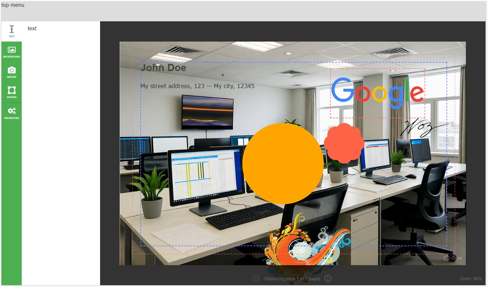

# Web2Print App

This is a web app which allows real-time interaction with a printable products. Supports MM and IN units.



## About

This is a pet project in which I'm working on **for fun**. There's no set goals nor timeline for this project.
You're welcome to fork it and use it for your own projects.

## For devs

This is plain ECMA + CSS + HTML. The only NPM lib used is WebPack which is used to compile the code into a single file, which is then served by a simple HTTP server.
Altough NPM packages CAN be used on it, make sure you **don't** use them, as they will be included in the final build.

## Running the app

```bash
npm install
npm run dev
// npm run watch
// npm run build
// npm run prod
```

## Document template

Check the `index.html` file for the document template model.

## More documentation?

If more devs joins the trainwrack, then the documentation will be expanded and updated.

## License

This still not a commercial project, so the license is: MIT
