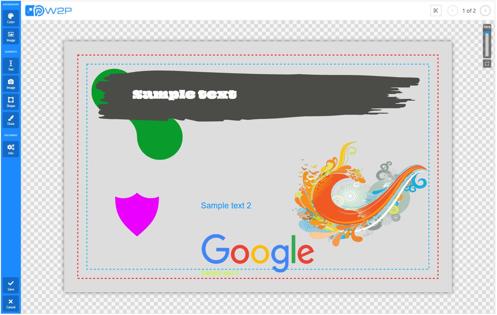
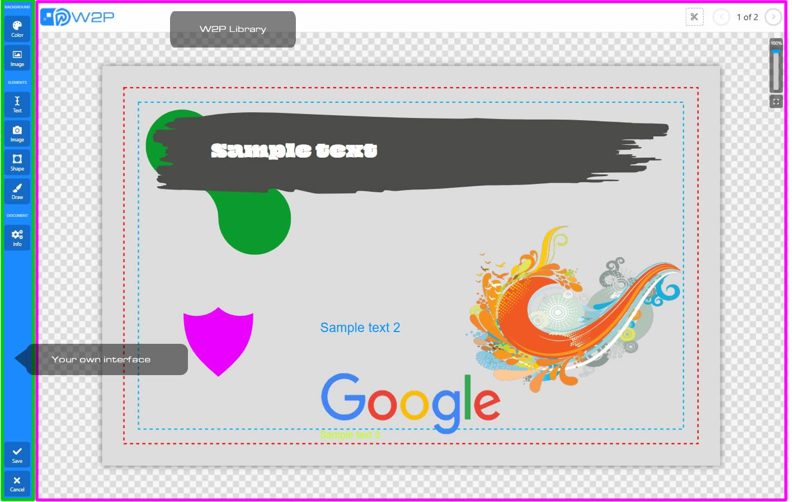

# W2P (Web-to-Print) — R&D Project

> **Pure-SVG • Zero dependencies • < 80 kB • AI-native • Print-ready from day one**

[](https://taniguchi-blog.com/w2p)
[](https://bundlephobia.com/result?p=w2p)
[](#zero-third-party-runtime-dependencies--and-why-it-matters)
[](LICENSE.txt)

**The only known open-source SVG-native Web-to-Print engine that is completely decoupled from its user interface.**



To date, no other publicly available library offers the same combination of core features while remaining fully agnostic to the frontend:

- True vector (SVG-only) document model — no Canvas, no bitmap fallback
- Multi-page pagination with bleed/cut-safe handling
- Precise element manipulation (move, resize, rotate, layer order, grouping, etc.)
- Scale-independent, print-ready output from day one
- **Zero coupling to any specific UI framework or toolset**

This means you — the developer — have complete freedom to build your own interface, toolbar, asset manager, image uploader, font picker, template system, or integrate with any existing design library. The W2P core only manages the document and its SVG structure; everything visible to the user is up to you.

This project is a proof-of-concept for a Web-to-Print (W2P) system built on a serverless architecture that uses SVG as the primary rendering engine instead of HTML Canvas.

The main goal is to explore SVG-based applications and demonstrate how SVG can be used to create true print-ready vector products.

## Why SVG?

Most existing web-to-print solutions rely on Canvas and generate bitmap/raster output.
This project uses SVG exclusively, which means:

- All graphics remain fully vector-based
- Infinite scaling and rotation without quality loss
- Direct export to print-ready vector formats (PDF, SVG, etc.)

## Why true ready-to-print vector output dramatically reduces operational costs

Traditional Canvas-based solutions produce bitmap files that must go through additional pre-press steps:

| Step (Canvas/bitmap workflow)           | Typical Cost / Time Impact                     | SVG-native (W2P) workflow                  |
|-----------------------------------------|------------------------------------------------|--------------------------------------------|
| Manual or automated pre-flight checks  | Hours per job, high rejection rate             | Eliminated — file is already print-ready   |
| Downsampling / resampling               | Processing time + quality risk                 | Not needed                                 |
| Color profile conversion                | Additional RIP time and potential shifts       | Native CMYK + spot color support possible  |
| Trapping / overprint handling           | Often manual or expensive plugin               | Handled directly in SVG/vector             |
| Imposition software licensing           | Thousands €/$ per year                         | Often unnecessary or greatly simplified    |
| Operator intervention / corrections     | 10–30% of jobs require touch-up                | Near-zero                                  |

**Result:** With W2P’s pure SVG output you can send files directly to RIP or digital press in most cases, cutting pre-press time and labor by 70–90% and virtually eliminating errors caused by rasterization or format conversion.

## Zero Third-Party Runtime Dependencies — And Why It Matters

**The compiled W2P library has absolutely no external runtime dependencies** (not React, Vue, lodash, jQuery, Konva, Fabric.js, Paper.js, or any other library).

**Why this is a critical advantage in production environments:**

| Benefit                                 | Real-World Impact                                                                 |
|-----------------------------------------|------------------------------------------------------------------------------------|
| Tiny bundle size                        | Core library is < 80 kB gzipped — loads instantly even on slow connections        |
| No version conflicts                    | Can be dropped into any existing codebase without breaking your dependency tree   |
| Long-term maintainability               | No risk of upstream breaking changes or abandoned packages                        |
| Security & compliance                   | Minimal attack surface; perfect for regulated industries or enterprise use       |
| Full control over performance           | No hidden overhead from framework abstractions or polyfills                       |
| Future-proof                            | Works today and will still work in 10 years without forced upgrades               |

Most “no-dependency” claims in the JavaScript ecosystem only apply to development; at runtime they still pull in dozens of packages. W2P truly ships **only vanilla (ECMAScript) JavaScript** once built which is cross-browser compatible.

## Can this project be used in production as-is?**

No. Although the project is over 80% complete, the core W2P library is still under active development (features like full element rotation and a proper save/export endpoint are not yet complete).

## Architecture Overview

The repository contains two distinct parts:

1. **`root` directory**
   This is just a demo interface showing one possible way to interact with the library.
   It handles UI tools (backgrounds, images, text, fonts, etc.).
   Feel free to ignore, delete, reuse, or completely replace it — it’s intentionally minimal and not the focus of the project.

2. **The W2P library (the actual important part)**
   A standalone SVG editor/engine that powers everything print-related. Current features include:

   - Creating, modifying, and deleting SVG elements
   - Moving, resizing, and rotating elements
   - Multi-page document handling and pagination
   - Scale/zoom and fit-to-view controls
   - Cut-safe/bleed area visualization
   - And more…

   The library exposes a clean public API so you can build your own custom frontend on top of it.



## How to Use the Library

Import the compiled W2P library in your frontend project and instantiate it using the public methods.
Full API documentation will be added at a later date meantime, the code is well-documented and self-explanatory.

This is, basically, a simple example of how to use the library in your project:

```html
<div id="w2p"></div>
<script src="dist/w2p.min.js"></script>
<script>
    const w2p = new W2p(template, document.getElementById('w2p'), config);
</script>
```

## Running the Project Locally

The library has zero third-party runtime dependencies once built.
Webpack is only used for bundling during development.

```bash
npm install
npm run watch   # development mode with file watching
npm run build   # production build
```

## Template Format – Simple, Declarative, AI-Ready JSON

W2P uses a **100% declarative, human-readable JSON template format** that describes the entire print product — sizes, bleed zones, pages, layers, text, images, and vectors — without any procedural code. It supports inches and millimeters, and is fully compatible with Adobe Illustrator and Inkscape.

### Example (85×55 mm business card, 2 sides)

```json
{
  "title": "Sample template 85x55mm — 2 sides",
  "size": { "width": 85, "height": 55, "measure": "mm", "dpi": 300, "cutline": 3, "safeline": 5 },
  "pages": [
    { /* front */ },
    { /* back */ }
  ]
}
```

### Why This Format Is a Game-Changer

| Advantage                              | Real-World Benefit                                                                                              |
|----------------------------------------|------------------------------------------------------------------------------------------------------------------|
| Pure data, no logic                    | Can be generated, parsed, and validated by AI models in milliseconds                                            |
| No Canvas or DOM required to render    | Server-side or edge rendering (Node.js, Cloudflare Workers, etc.) with zero browser                              |
| Fully deterministic                    | Same JSON → identical SVG/PDF every time → perfect for automation and QA                                         |
| Nested structure mirrors design tools  | Easy migration from Figma, Adobe Illustrator, Canva exports, etc.                                                |
| Tiny payload                           | A complex 8-page brochure template is usually < 15 kB (vs. 2–10 MB of PNGs or proprietary binaries)             |
| Version-control friendly               | Store thousands of templates in Git, diff changes, roll back instantly                                           |

### AI & Automation Superpowers (The Real Future Potential)

Because the template is just structured data, W2P becomes the perfect rendering backbone for generative design:

| Use Case                              | How It Works Today → Tomorrow                                                    | Value Unlock                                   |
|---------------------------------------|----------------------------------------------------------------------------------|-------------------------------------------------|
| AI-generated business cards / flyers  | LLM / Stable Diffusion generates JSON → W2P instantly renders perfect print files| Zero manual design time                         |
| Personalized direct mail at scale     | Feed customer CSV → AI fills JSON → instant PDF with bleed & crop marks         | Millions of unique pieces in minutes            |
| Dynamic packaging & labels            | Product data → AI lays out die-cut + spot colors → press-ready SVG               | On-demand short runs become profitable          |
| Template “remixing”                   | AI mutates existing JSON (colors, fonts, layout) → new variants                 | Infinite template library from a few seeds      |
| Figma → print-ready pipeline          | Export layers → convert to W2P JSON → perfect CMYK PDF in one click              | Designers never leave their tool                |
| Automated pre-flight & compliance     | AI reads JSON → flags text in bleed, low-res images, missing overprint           | Eliminate 99 % of pre-press rejections          |

**Bottom line:**
W2P is not just another editor — it’s the **first open, vector-native, dependency-free rendering engine explicitly designed to be driven by AI and automation**.

Once the export endpoint definitions land, this repository has the potential to become the **standard back-end for every generative print startup on the planet**.

## Total Visual Customization – Pure CSS Variables (Zero JavaScript Overrides)

W2P is built from the ground up to be **100% themable** using only CSS custom properties — no need to fork the library, no shadow-DOM piercing, no class name conflicts.

Just drop a `<style>` block anywhere in your page (or include a CSS file) and instantly re-skin the entire editor — including the sample UI — to match your brand, dark mode, or client requirements.

### Live Example – Full CSS Theme Override

```css
:root {
  /* Dark mode example – just override the variables */
  --w2p-divwrap-bg-color:                  #1e1e1e;
  --w2p-divwrap-border:                    1px solid #333;

  --w2p-toolbar-bg-color:                  #252526;
  --w2p-pagination-button-border:          3px solid #007acc;
  --w2p-pagination-button-color:           #007acc;
  --w2p-pagination-button-hover-color:     #0099ff;
  --w2p-button-color:                      #cccccc;
  --w2p-button-hover-color:                #ffffff;

  --w2p-page-checkerboard-pattern-light:   #2d2d2d;
  --w2p-page-checkerboard-pattern-dark:    #252525;

  --w2p-cutline-color:                     #ff5555;
  --w2p-safezone-color:                    #00ffff;

  --w2p-wrapper-rect-stroke-color:         #00ffff;
  --w2p-wrapper-handle-size:               18px;
  --w2p-wrapper-delete-fill-color:         #ff3333;
  --w2p-wrapper-edit-fill-color:           #00d4aa;
  --w2p-wrapper-layer-fill-color:          #8888ff;
}
```

### What You Can Fully Control (and more)

| Category                | Variables (partial list)                                      | Perfect For                                      |
|-------------------------|---------------------------------------------------------------|--------------------------------------------------|
| Backgrounds & borders   | `--w2p-divwrap-bg-color`, `--w2p-toolbar-bg-color`           | Light / dark themes, branded portals             |
| Buttons & icons         | `--w2p-button-color`, `--w2p-pagination-button-*`            | Match your design system exactly                 |
| Page wrapper           | `--w2p-page-checkerboard-pattern-*`                           | Subtle patterns, high-contrast accessibility     |
| Bleed & safe zones      | `--w2p-cutline-color`, `--w2p-safezone-dasharray`             | Follow print-house guidelines                    |
| Selection handles       | `--w2p-wrapper-handle-size`, `--w2p-wrapper-*`               | Mobile-friendly, high-visibility mode            |
| Transform controls      | `--w2p-wrapper-delete-fill-color`, etc.                       | Custom action colors (delete = red, lock = gray) |

**Result:**
One line of CSS can instantly transform the editor into:

- Minimal light theme (default)
- High-contrast accessibility mode
- Fully branded client portal
- Retro terminal dark theme
- Print-house compliance mode (red bleed, cyan safe)

**Enterprise-ready, white-label-ready, designer-friendly.**

## Target Markets & Commercial Opportunity

Even though the current license is non-commercial, the technology directly targets multi-billion-dollar verticals:

| Market                        | Current Pain Point                              | W2P Advantage                              | Est. Global TAM |
|-----------------------------|--------------------------------------------------|---------------------------------------------|-----------------|
| Business cards & stationery  | 100 % of online orders still require pre-press   | Zero-touch print-ready files                | ~$18 B          |
| Packaging & labels           | Complex die-lines, spot colors, variable data   | Native vector + multi-page + bleed support  | ~$45 B          |
| Wide-format (banners, signs) | Huge bitmap files → slow upload & RIP            | < 200 kB files, instant processing          | ~$80 B          |
| On-demand publishing         | PDF errors cause 20–30 % reprints                | Mathematically perfect SVG → PDF export     | ~$30 B          |

A production-ready version of this engine (or a commercially licensed fork) could capture significant margin in any of these segments.

## Roadmap – Where Help or Funding Has Immediate Impact

| Milestone                          | Status         | Impact if Completed                          |
|------------------------------------|----------------|----------------------------------------------|
| Full element rotation & transform  | 70 %           | Unblocks 90 % of real-world templates        |
| SVG → PDF export (CMYK, bleeds)    | Not started    | Enables direct press submission              |
| Variable data / JSON merge         | Not started    | Opens mail-merge & personalization market    |
| SSR rendering backend              | Not started    | Server-side PDF generation at scale          |
| Commercial license tier            | Planned        | Path to sustainable development              |

## Performance Comparison

| Library / Tool       | Runtime deps | Gzipped size | Output type | Ready-to-print without extra steps? |
|----------------------|--------------|--------------|-------------|-------------------------------------|
| W2P (this project)   | 0            | ~48 kB       | Pure SVG    | Yes                                 |
| Fabric.js            | 0            | 241 kB       | Canvas → PNG| No                                  |
| Konva.js             | 0            | 189 kB       | Canvas      | No                                  |
| Canva / Crello SDK   | 40+          | > 2 MB       | Bitmap      | No                                  |
| PrintCSS-based       | 15+          | > 1.3 MB     | Mixed       | Rarely                              |

## Interested in production deployment or a commercial license?

→ Open an issue • Star to signal demand • Email for licensing, enterprise support, or investment discussions
